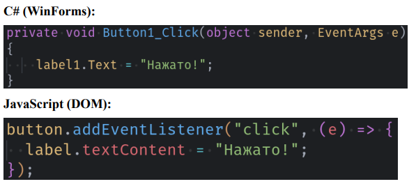
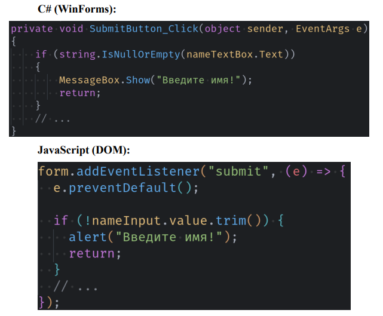

# Лабораторная работа №20. Работа с DOM и событиями в JavaScript

## Основная информация

- **ФИО:** Зламанюк А.А., Телятникова Е.П.
- **Группа:** ИСП-231
- **Дата:** 20.03.2026

## Описание

В ходе данной лабораторной работы мы научились работать с DOM-деревом, освоили поиск HTML-элементов из JavaScript, научились изменять содержимое страницы, освоили обработку событий пользователя, а также создали простой TODO-лист.

## Структура проекта

```
isrpo_lab20/
│
├── README.md
├── index.html
├── main.js
├── dynamicElements.html
├── dynamicElements.js
├── style.css
└── img/
    ├── gitPushLab20_DOM_Events_Telyatnikova_Zlamanyuk.png
    ├── step2_domStructureLab20_Zlamanyuk_Telyatnikova.png
    ├── step3_domSelectionLab20_Zlamanyuk_Telyatnikova.png
    ├── step4_domManipulationLab20_Zlamanyuk_Telyatnikova.png
    ├── step5_clickEventLab20_Zlamanyuk_Telyatnikova.png
    ├── step6_inputEventLab20_Zlamanyuk_Telyatnikova.png
    ├── step7_miniTaskLab20_Zlamanyuk_Telyatnikova.png
    ├── step8_formInputLab20_Zlamanyuk_Telyatnikova.png
    ├── step9_formValidationLab20_Zlamanyuk_Telyatnikova.png
    └── step10_dynamicElementsLab20_Zlamanyuk_Telyatnikova.png
```
## Сравнение с C# (WinForms/WPF)
**DOM в JS = Controls в C# WinForms**
|**Концепция**|**C# (WinForms)**|**JavaScript (DOM)**|
|:---:|:---:|:---:|
|Найти элемент|Button myButton = this.Controls["myButton"]|const myButton = document.getElementById("myButton")|
|Изменить текст|label1.Text = "Новый текст"|label.textContent = "Новый текст"|
|Добавить обработчик|button1.Click += HandleClick|button.addEventListener("click", handleClick)|
|Создать элемент|Button btn = new Button()|const btn = document.createElement("button")|
|Добавить в контейнер|panel1.Controls.Add(btn) |panel.appendChild(btn)|
|Скрыть элемент|button1.Visible = false|button.style.display = "none"|
### Events в JS = События в C#

### Валидация формы

### Главные отличия
|**Аспект**|**C# WinForms**|**JavaScript DOM**|
|:---:|:---:|:---:|
|Компиляция|Да|Нет (интерпретация)|
|Типизация|Строгая|Динамическая|
|Ошибки|Во время компиляции|Во время выполнения|
|UI-дизайнер|Есть (визуальный)|Нет (только код)|
|Платформа|Windows|Любой браузер|
### Преимущества DOM перед WinForms:
* Кроссплатформенность (работает везде)
* Не нужна установка приложения
* Легко обновлять (обновил файлы — всё работает)
* Современные UI (CSS, анимации)
### Преимущества WinForms перед DOM:
* Визуальный дизайнер (drag & drop)
* Ошибки на этапе компиляции
* Интеграция с Windows API
* Более понятная структура
**Вывод:** DOM и WinForms решают схожие задачи, но разными подходами.